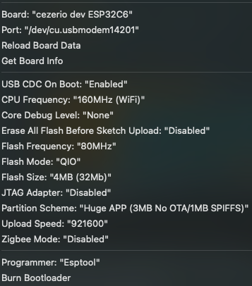

<h1 align="center">
Matter over Thread LD2410 sensor 
</h1>

<!-- START doctoc generated TOC please keep comment here to allow auto update -->
<!-- DON'T EDIT THIS SECTION, INSTEAD RE-RUN doctoc TO UPDATE -->

- [:artificial_satellite: Introduction](#artificial_satellite-introduction)
  - [Features](#features)
- [:pinched_fingers: Requirements](#pinched_fingers-requirements)
- [:surfing_woman: Installation](#surfing_woman-installation)
- [:snowboarder: ESP32 boards](#snowboarder-esp32-boards)
- [:unicorn: Build it](#unicorn-build-it)
  - [:books: Config](#books-config)
- [:point_right: Commission device](#point_right-commission-device)
- [:label: Config variables (config file)](#label-config-variables-config-file)
- [Implementation details](#implementation-details)
- [:roller_coaster: Going further](#roller_coaster-going-further)
- [:ledger: License](#ledger-license)

<!-- END doctoc generated TOC please keep comment here to allow auto update -->

## :artificial_satellite: Introduction
Matter device over Thread implementation for LD2410 sensor.

### Features
- Light (onboard LED)
- Occupancy
- Illuminance

## :pinched_fingers: Requirements

- Arduino IDE 2.x

## :surfing_woman: Installation
Follow the installation guide described here [Installation guide](https://docs.espressif.com/projects/arduino-esp32/en/latest/installing.html)

:warning: Do not forget to do the post installation step with the '''python get.py''' script [here](https://docs.espressif.com/projects/arduino-esp32/en/latest/installing.html#debian-ubuntu)

## :snowboarder: ESP32 boards
- C6 (tested)
- H2 (not tested)

## :unicorn: Build it
### :books: Config

## :point_right: Commission device
Commissioning is made using the python-matter-server dashboard.
At start, the device will automatically connect to the thread network with provided credentials.
Then commission the device with the configured matter key.

## :label: Config variables (config file)
| env name                       | description     | default value      |
| -------------------------------| ----------------| -------------------|
| CLI_NETWORK_KEY                        | Thread network key                                                      |    | 
| CLI_NETWORK_CHANEL                        | Thread network channel                                      | 24|
| RX_PIN                      | LD2410 RX pin                   | 4  |
| TX_PIN                  | LD2410 TX pin          | 5               |
| CHIP_DEVICE_CONFIG_DEVICE_VENDOR_NAME                    | Matter device vendor name   | "" |
| CHIP_DEVICE_CONFIG_DEVICE_VENDOR_ID                    | Matter device vendor id                           | 0xFFF1 |
| CHIP_DEVICE_CONFIG_DEVICE_PRODUCT_NAME                  | Matter device product name  | "" |
| CHIP_DEVICE_CONFIG_DEVICE_PRODUCT_ID                  | Matter device product id  | 0x8001 |
| CHIP_DEVICE_CONFIG_DEFAULT_DEVICE_HARDWARE_VERSION_STRING                  | Matter device hardware version  | "" |
| CHIP_DEVICE_CONFIG_DEVICE_SOFTWARE_VERSION_STRING                  | Matter device software version | "" |

## Implementation details
All clusters and endpoints types are available in Arduino/hardware/espressif/esp32/tools/esp32-arduino-libs/esp32/include/esp_matter/esp_matter_endpoint.h and Arduino/hardware/espressif/esp32/tools/esp32-arduino-libs/esp32/include/esp_matter/esp_matter_cluster.h

## :roller_coaster: Going further
- change DEVICE, PRODUCT, VENDOR, ...

## :ledger: License
[License Apache 2.0](./LICENSE)
